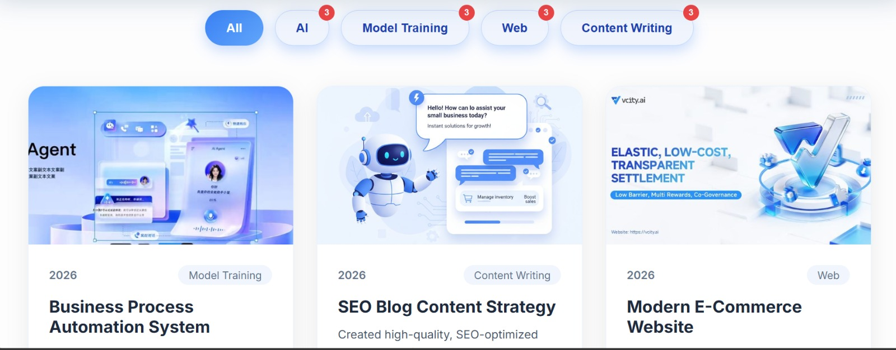
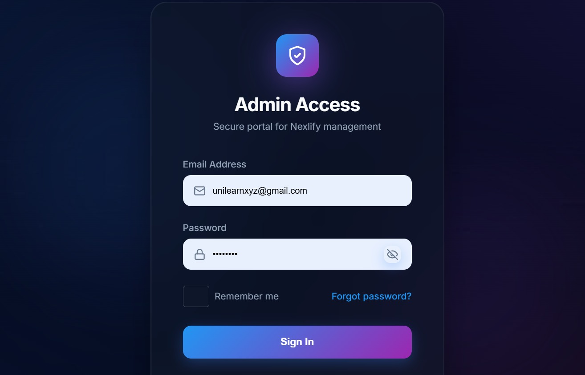
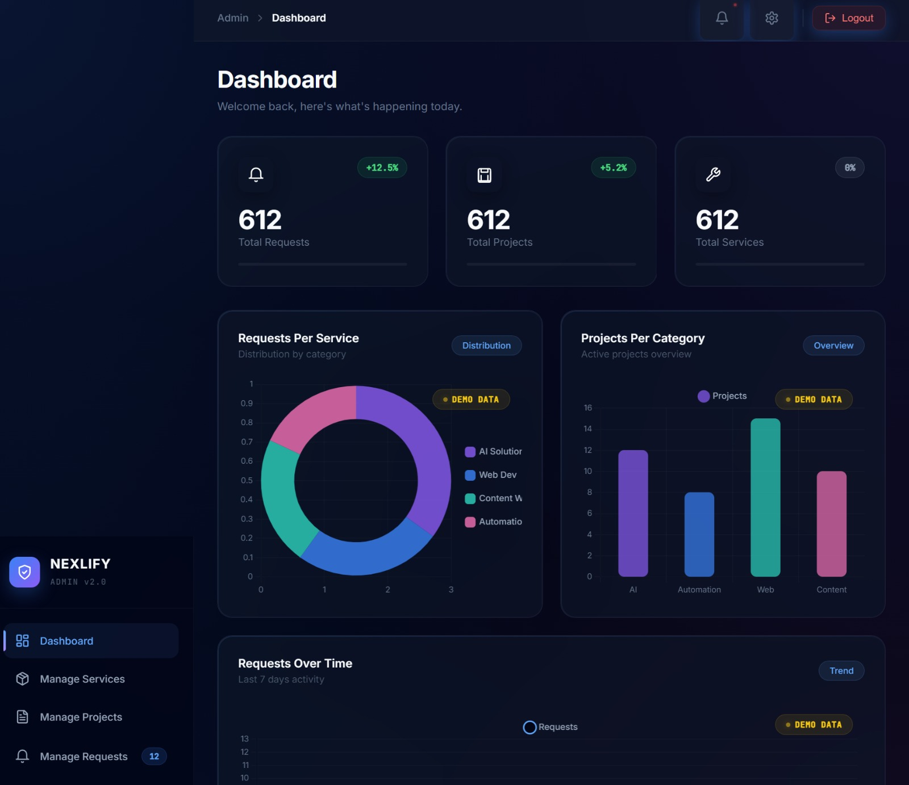
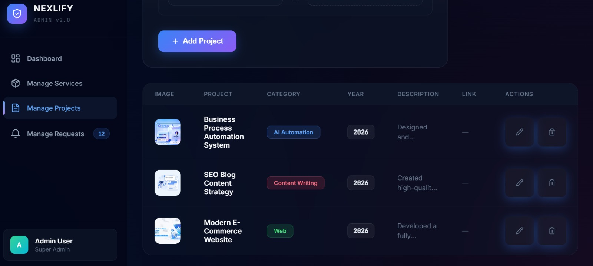

# Nexlify — Professional Services Marketplace


**Full-Stack Service Marketplace** offering **AI Automation**, **Web Development**, and **Professional Content Writing**.

Built as a complete end-to-end platform with a modern admin dashboard for managing services, projects, and client requests.

## ✨ Features

- **Service Marketplace** with three main categories:
  - AI Automation & Agents
  - Custom Web Development
  - Professional Content Writing
- **Modern Admin Dashboard** with real-time analytics
- **Project Management System** (add, edit, delete projects)
- **Request Tracking** with status management
- **Responsive & Beautiful UI** (light + dark ready)
- **Secure Backend** with rate limiting, validation, and proper error handling

## 🛠️ Tech Stack

**Frontend**: React.js + Vite + Tailwind CSS  
**Backend**: Node.js + Express.js + MongoDB  
**Other**: JWT Authentication, Multer (file upload), Chart.js, Helmet, Rate Limiting

## 📸 Screenshots

### Manage Projects


### Admin Login

### Admin Dashboard


### Project Cards


## 🚀 How to Run Locally

### 1. Clone the Repository
```bash
git clone https://github.com/abeerajaved1/nexlify-services-marketplace.git
cd nexlify-services-marketplace

### 2. Backend Setup
cd backend
npm install
cp .env.example .env   # Fill your MongoDB URI and other credentials
npm start

### 3. Frontend Setup
cd ../frontend
npm install
npm run dev
Open http://localhost:5173 to view the platform.